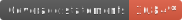
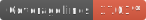

# Firebase code in support for common

This repository contains code for the clodufunctions and the website hosting, and some scripts to manage the code.

# Local environment

To run everything locally you could use the following command:

`yarn start`

For more information you could check [here](https://github.com/daostack/common-firebase/blob/dev/doc/local.md)

# firestore

To run the script, you need to install gcloud and 

For ios:
```curl https://sdk.cloud.google.com | bash```

# hosting 
# functions

## Running the Cloud functions

To run the firebase functions for the api you can run the following commands to:

### Locally
Run a local instance (this will not run a pubsub function):
```
firebase emulators:start --only functions
```
Note that this these cloud functions will operate on the production instance if started like that.

### Deploy

To deploy these functions, you will need some secrets in ./functions/_keys.
Please ask the administrators for these keys.


```
yarn deploy:staging
yarn deploy:production
```

### Development
To run a pubsub function you will need to have firebase-tools installed, run
```
npm i -g firebase-tools
```
Then run the following command to create a shell
```
firebase functions:shell
```
you can then call the API functions

```
graphql.graphql.get('update-daos')
graphql.graphql.get('update-proposals')
graphql.graphql.get('update-proposal-by-id')
```

### Top up the relayer
To top up the relayer send xDAI or rinkeby to this address ```0x86FC3E21B2897641BCa28404e06f37E9157E12b3```


## API endpoints

There are API endpoint for testing the functionality of the application. They are:

1. For testing the email sending functionality
   
   **Endpoint** `/tests/sendEmail
   
   **Query Parameters**
   
    - **To (required)** - the email address of the test mail receiver
    - **Subject (optional)** - optional subject for the test email
    - **Message (optional)** - optional message for the test email
    
## Testing

### set up the environment

The cloud functions are communicating with a variety of services. Some of them are mocked, others 
are running in a docker containers. To start these run 

`docker-compose up`

### Running the tests

For testing we are using the Jest testing framework. All tests are written in TypeScript
and must be ending with either *.spec.ts or *.test.ts. The testing commands are:

`yarn test` - runs the testing suit once. This command is also ran after each commit.

`yarn test:watch` - runs the test suit on file changes.

`yarn test:coverage` - collects the coverage of the tests.

`yarn test:badges` - generates code coverage badges.

`yarn ci:test` - for now it does exactly the same as `yarn test`, but we can add additional logic in the feature 
only for when we are running the tests in CI environment.

----

### Test helpers

* `runTest.ts` - Used for running the tests. It has some initialization and cleanup logic for the firebase that 
otherwise has to be duplicated in every test suite. Must not be used with custom `beforeAll()` and `afterAll()`. 
Example usage: 

```javascript
import { runTest } from '@helpers/runTest';

// Required for the Firebase Setup
import '@functions';

runTest((funcs) => {
  it('should do stuff', () => {
    doStuff();
  });
})
```